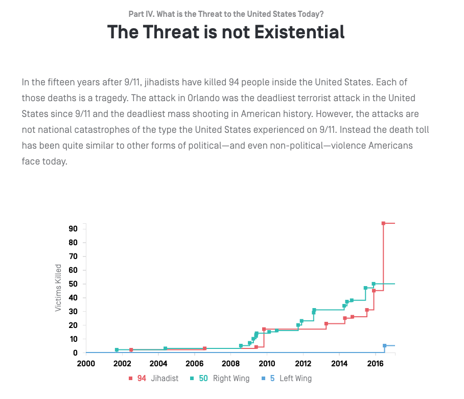

# Terrorism events in the USA since 2001/09/11

This repo contains a copy of the json dataset provided by the [New America foundation](https://github.com/newamericafoundation) used to create [this interactive visualization](https://www.newamerica.org/in-depth/terrorism-in-america/what-threat-united-states-today/#the-threat-is-not-existential)

Screenshot of the visualization taken on 2017-02-02:

A csv copy is kept in the `csv` subdirectory.

## Contributing

Pull requests are welcome, in the regrettable but eventually inevitable event of a future terrorist incident on US soil. Only contribute events in which at least one death occurs.

### Definition of terrorism

From Wikipedia:

> The most common definition of terrorism is used, which includes the following:
> 
>  - It is the use of violence or threat of violence in order to purport a political, religious, or ideological change.
>  - It can only be committed by non-state actors or undercover personnel serving on the behalf of their respective governments.
>  - It reaches more than the immediate target victims and is also directed at targets consisting of a larger spectrum of society.
>  - It is both mala prohibita (i.e., crime that is made illegal by legislation) and mala in se (i.e., crime that is inherently immoral or wrong).
> 
>  The following criteria of violence or threat of violence fall outside of the definition of terrorism:
> 
>  - Wartime (including a declared war) or peacetime acts of violence committed by a nation state against another nation state regardless of legality or illegality that are carried out by properly uniformed forces or legal combatants of such nation states.
>  - Reasonable acts of self-defense, such as the use of force to kill, apprehend, or punish criminals who pose a threat to the lives of humans or property.
>  - Legitimate targets in war, such as enemy combatants and strategic infrastructure that are an integral part of the enemy's war effort.
>  - Collateral damage, including the infliction of incidental damage to non-combatant targets during an attack on or attempting to attack legitimate targets in war.
